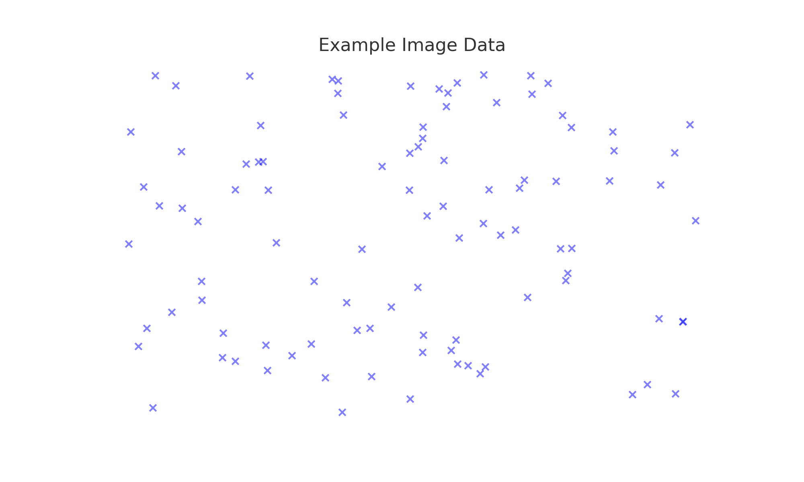
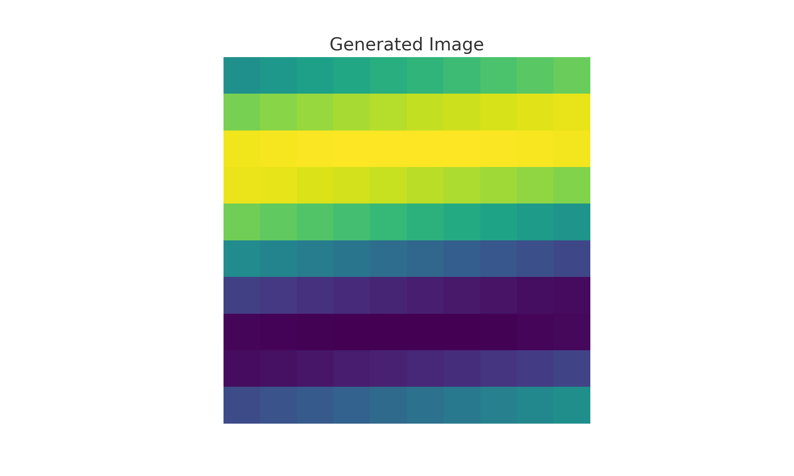

# GAN for Image Generation


This repository contains code and resources for generating images using Generative Adversarial Networks (GANs). The project includes a Jupyter Notebook (`GAN_For_Image_Generation.ipynb`) that demonstrates the implementation of a GAN for creating synthetic images.


## Introduction



Generative Adversarial Networks (GANs) are a class of machine learning frameworks designed by Ian Goodfellow and his colleagues in 2014. GANs consist of two neural networks, the generator and the discriminator, which compete against each other to generate new, synthetic instances of data that can pass for real data.

## Getting Started

### Prerequisites

Ensure you have the following installed:
- Python 3.x
- Jupyter Notebook
- PyTorch


### Installation

1. Clone the repository:
    ```sh
    git clone https://github.com/STiFLeR7/GAN_For_Image_Generation.git
    ```
2. Navigate to the project directory:
    ```sh
    cd GAN_For_Image_Generation
    ```

## Usage

1. Open the Jupyter Notebook:
    ```sh
    jupyter notebook GAN_For_Image_Generation.ipynb
    ```
2. Follow the instructions in the notebook to train the GAN and generate images.
3. 


## Contributing

Contributions are welcome! Please open an issue to discuss what you would like to change or add.

1. Fork the repository.
2. Create a new branch:
    ```sh
    git checkout -b master
    ```
3. Make your changes and commit them:
    ```sh
    git commit -m 'Add some feature'
    ```
4. Push to the branch:
    ```sh
    git push origin master
    ```
5. Open a pull request.
